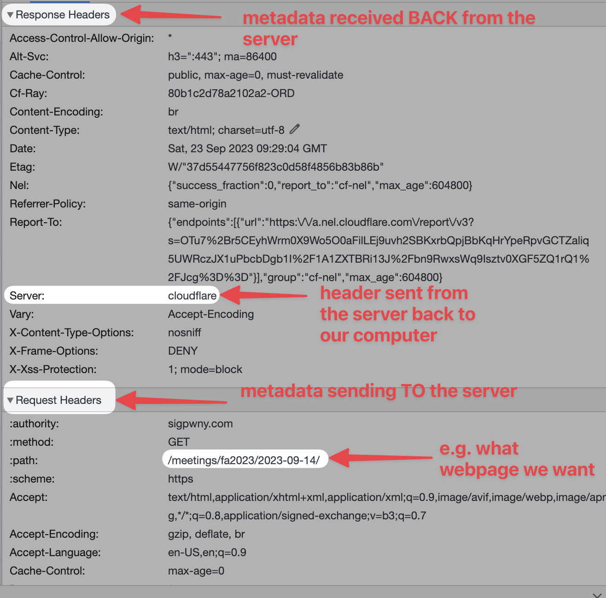
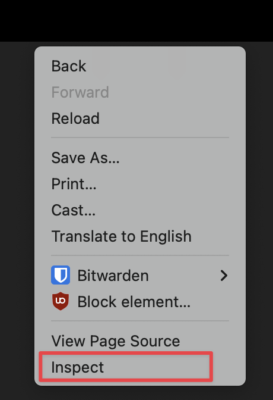
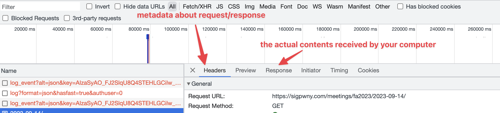
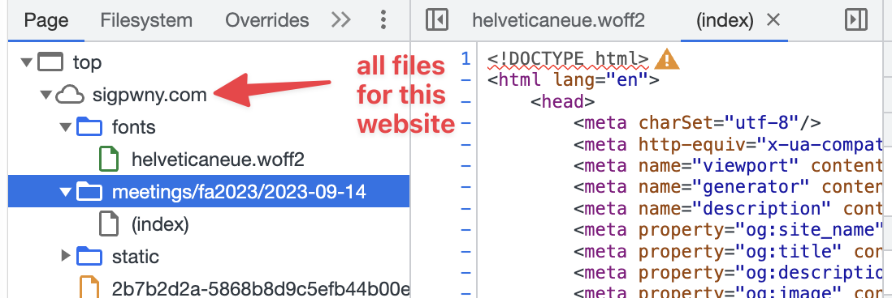
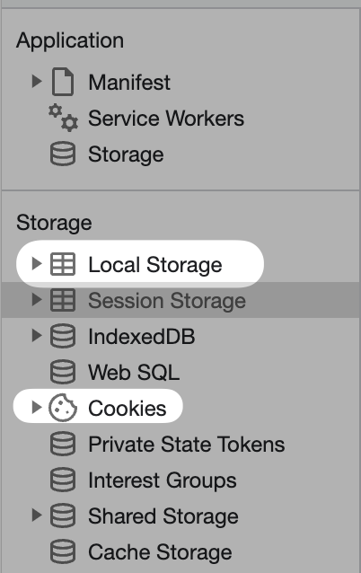
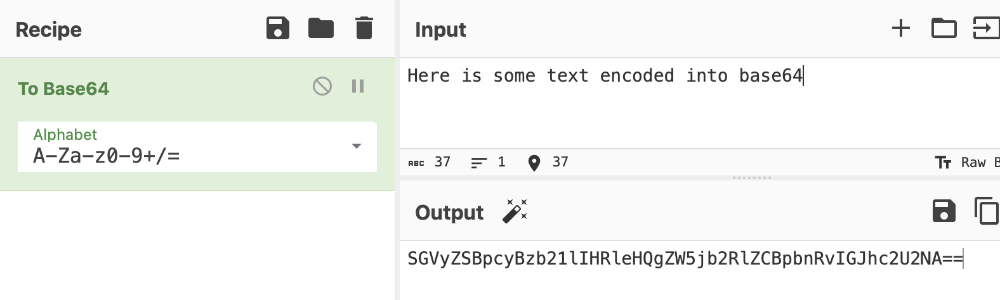
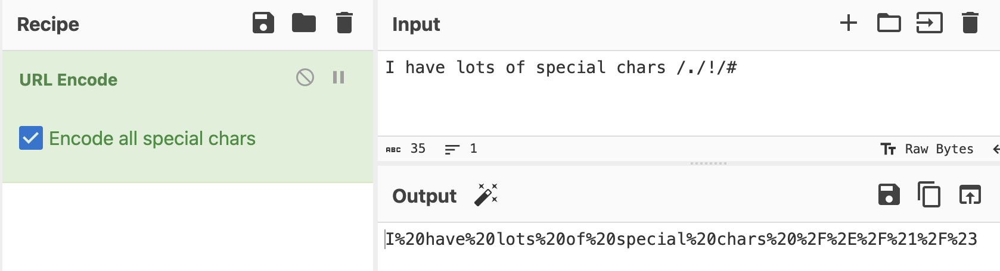

# Web

We have run two web meeting this semester:

- [Web 1](https://sigpwny.com/meetings/fa2023/2023-09-07/), covering HTML, CSS, and Javascript
- [Web 2](https://sigpwny.com/meetings/fa2023/2023-09-14/), covering SQLi and XSS


## Website Structure

Websites use three main languages: HTML, CSS, and Javascript. HTML is the skeleton of the website, and organizes each of the different elements onto the user's screen. CSS is how you edit and develop the styles on a website. The most important and widely used language within the web is Javascript. Javascript allows you to dynamically change elements within your site, have something happen when a button is pressed, or make a requests to other computers.

## Client-Server Model

When you click on a link within your browser, your computer makes a request to a server located at the address of the link you clicked. This request is then processed on the server's side, and the server sends back the webpage you want to load. This is the Client-Server Model. By manipulating processes within this model's process, you can access extra content on either the server or client side!

When content is sent between your computer and the server, it includes additional metadata called "Headers". Some of this data remains in your browser, either as **cookies** or **local storage** (technically more kinds).



- Cookies are saved per website, and are sent in each request. They can be changed by Javascript or a request header.
- Local Storage is saved per website, but are not sent in each request. They can be changed by Javascript in your browser.

## Devtools

Developer tools is how you view additional website about an information. For our challenges, we reccommend you download Chrome or Firefox, and not use Safari.

To open devtools, hit `Ctrl + Shift + C` (windows) or `Command + Shift + C` (mac). Alternatively, right click and hit inspect.



Chrome Devtools is a suite of software developer information for web development. During challenges, you will be able to poke around different tabs. Here are some helpful tabs to lookout for:

* Console (you can run your own javascript in this tab)


Pro Tip: You can use breakpoints within the console by clicking next to the line number. This can allow you to stop at certain lines before the run and check variables

* Network

The network tab shows all information transmitted to/from your computer to the server (website).




* Sources

The sources tab shows a listing of all files on the server that were requested.



* Application

The application tab shows the saved cookies, local storage, and other information stored in your browser.



This is not an exhaustive list, but just a few useful tabs within Devtools.

## Encodings you should know about:

base64 - Looks like this 


url encoding - Looks like this



You can use [CyberChef](https://gchq.github.io/CyberChef/) to decode.

## SQL Injections

More in-depth explanations can be found in the Web 2 slides about SQL.

SQL, or Structured Query Language is a language for fetching information from a server.

For example,

```sql
SELECT netid, firstname FROM students WHERE lastname = "Tables"
```


If code is written incorrectly, you can modify an SQL Statement as shown above.

More details on SQL: https://portswigger.net/web-security/sql-injection
Resource on SQL Union Attack: https://portswigger.net/web-security/sql-injection/union-attacks

## Command Injections

Command Injection lets you execute multiple linux commands at the same time. It is very similar to SQL Injection, except instead of 
changing a database query, you are changing commands executed in the command line.

For example, in your terminal, you are able to execute multiple commands using the `;` ability

```
$> echo "command 1"; echo "command 2"
command 1
command 2
```

If you are able to "inject" something directly into the command you are executing, you can make it do additional things.

```
$> echo "YOUR INPUT"
```

If I had set `YOUR INPUT` to `-HI"; ls ; "BYE-`

then the command would look like

```
echo "-HI"; ls; "BYE-"
```

Some useful commands are:

+ `ls` - list files
+ `cat x.txt` - output the contents of the file `x.txt`

If you want more resources on learning the linux command line...

+ Review our [Setup/Terminal Meeting Slides](https://sigpwny.com/meetings/fa2023/2023-09-03/)

## Cross-Site Scripting (XSS)

Cross-Site Scripting is a vulnerability that allows an attacker to execute malicious scripts on a website. This can be used to steal cookies, redirect users to malicious websites, or deface the website.

I like to think of XSS as as another type of injection attack, but instead of injecting into a database or command line, you're injecting into the website's HTML.

For example, let's say you have a website that displays a user's name on the page. If the website includes the input directly into the HTML, you can put your own HTML code in the input and have it execute on the page.

```html
<p>Welcome, <span id="username">USER INPUT</span></p>
```

If I had set `USER INPUT` to `<script>alert("Hello!")</script>`, then the website would display a popup saying "Hello!".

```html
<p>Welcome, <span id="username"><script>alert("Hello!")</script></span></p>
```

More details on XSS: https://portswigger.net/web-security/cross-site-scripting

A useful resource for receiving requests is [webhook.site](https://webhook.site/). For example, if you need to extract some data from a website, you can have your XSS payload send a request to your webhook.site URL with the data you need.

Be careful when exfiltrating data to make sure the data on the page you are trying to extract is actually loaded.

```js
window.addEventListener('load', () => {
    // ... your code here
});
```